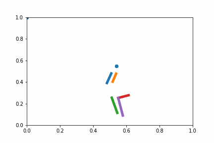
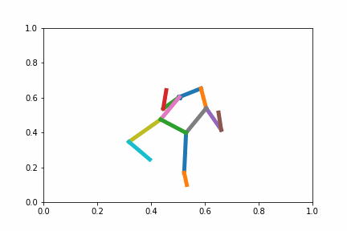

## Classification \& Generation Of Human Pose Sequences

### 1. Abstract

The capstone project investigates the effect of mapping a dataset into a latent space using human pose data, via the two tasks of classification and generation. Classically, some machine learning methods implicitly or explicitly transform the original dataset into an embedded space with a different dimension, sometimes even infinite-dimensional space, such as SVMs, and this yields good results in classification or regression as downstream tasks. This paper explores the usage of variational autoencoders (VAEs) in this embedding process on a complex dataset, namely human activity poses, and the data in latent spaces's  performance in the task of sequence modelings, such as classification of activity from poses and auto-generation of probable subsequent poses. Using RNNs, the results include a positive performance change in the classification task, although there is a notion of optimal dimension, and a negative impact on the generation task. Further explorations are necessary to concretely determine the cause of this negative effect on secondary tasks after mapping, and the notion of optimality in the number of dimensions in the latent space. This problem, from both a practical standpoint, like for autoencoders training, and a theoretical standpoint, like for deciding the depth of hierarchical probabilistic models, are very interesting and should be investigated at lengths.

### 2. Generation results

**Realistic generation results**

 

**Bad generation results**
