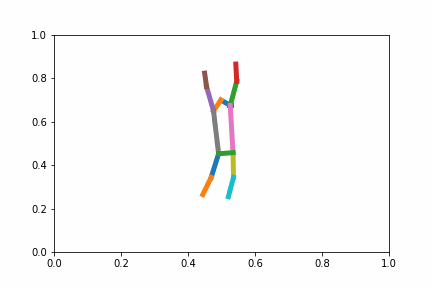
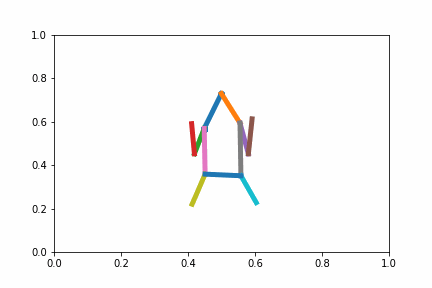
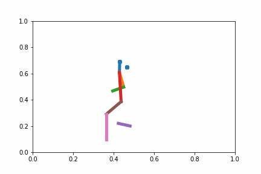
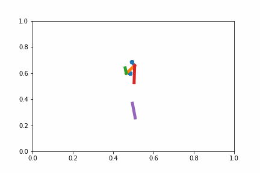

## Classification \& Generation Of Human Pose Sequences

### 1. Abstract

The capstone project investigates the effect of projecting a human pose dataset into a different space on the peformances of neural networks via the two tasks of classification and generation. The problem here is interesting from both the theoretical and the practical perspective: modeling complex sequences are something researchers wish to do, and modeling human pose sequences can be applied into many possible products. Classically, some machine learning methods implicitly or explicitly transform the original dataset into a space with a different dimension (i.e. embedding), sometimes even infinite-dimensional space, such as Support Vector Machiness, and this transformation, when applied before classification or regression, yields performance gains. This paper explores the usage of variational autoencoders (VAEs) in this embedding process on a complex dataset, namely human activity poses, and how this embedding changes the performance in the task of sequence modeling, such as classification of activity from poses and generation of probable subsequent poses. The hypothesis is that neural networks can learn complex dynamics of the human pose sequences. Using recurrent neural networks architectures, the results include an increase in accuracy in the classification task if we use the embedding instead of the original data (up to 7\% increase in accuracy, with respect to the original data), although there is a notion of optimal embedding dimension, after which performance ceases to improve, and an increase in prediction error on the generation task, potentially due to the compounding of errors in a system of neural networks.\

The results indicate that there can be significant performance increases if VAE embedding is used as a preprocessing step for sequence modeling, outperforming models that use the raw input. We can apply sequence modeling models in this paper to various classification and generation tasks, including human pose modeling, which is seen in many applications.

### 2. Generation results

**Realistic generation results**

 

**Mode collapse**

 

**Drifting**

 

**Long sequences**

What the network sees: 

+5 generated frame:

+15 generated frame:

+30 generated frame:

+50 generated frame: 

**More generated sequences:** https://drive.google.com/drive/u/0/folders/1T4I-VpoKf2Ae96JpF101RDN6eWr6k-dU

**Processed data:** https://drive.google.com/file/d/1pH2bQS8jtqz7zSNH3QoHh68EjaWykHOF
